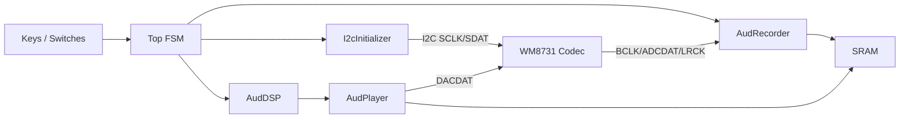

# Lab 3 — Audio Recorder / Player with I²C & WM8731

**Course:** Digital Circuits Lab, NTU  
**Board:** Terasic DE2-115 (Cyclone IV E)  
**Language:** SystemVerilog  
**Codec:** Wolfson WM8731

---

## Overview

A hardware **audio recorder and player** that:

1. Uses **I²C** to initialise the **WM8731** audio codec on DE2-115.
2. Records up to **30 seconds** of 16-bit audio to external **SRAM** (1 M × 16).
3. Plays back the recording at **normal, 2×–8× faster, or 2×–8× slower** speed, using **piecewise-constant** or **linear interpolation** for slow-play modes.

---

## System Architecture



---

## Module Descriptions

### `Top.sv` — Top-level FSM

Five states controlling the overall flow:

| State | Triggered by | Action |
|-------|-------------|--------|
| `S_IDLE` | power-on / reset | Idle; I²C not yet done |
| `S_I2C` | automatic after reset | Run `I2cInitializer` to configure codec registers |
| `S_RECD` | `Key0` (start) | Stream ADC samples to SRAM at sequential addresses |
| `S_PLAY` | `Key0` again | Read SRAM, pass through `AudDSP`, output to DAC |
| `S_PLAY_PAUSE` | `Key1` | Freeze SRAM address; hold DAC output |

Speed and interpolation mode are selected by on-board switches (`i_speed[2:0]`, `i_is_slow`, `i_slow_mode`).

### `I2cInitializer.sv` — I²C configuration

Sequences through the WM8731 register write list over I²C (2-wire: `SCLK`, `SDAT`). The reference clock provided to this module must be ≤ 100 kHz (generated via PLL from the 50 MHz system clock or the 12 MHz BCLK). Uses the power-down register to keep XCLK gated until configuration completes.

### `AudRecorder.sv` — ADC capture

Samples `i_AUD_ADCDAT` on each `BCLK` / `ADCLRCK` edge and writes successive 16-bit words to SRAM. Tracks the write address and asserts a stop signal when 30 s worth of samples are stored.

### `AudDSP.sv` — Variable-speed DSP

| Mode | Operation |
|------|-----------|
| 1× | Pass-through |
| 2×–8× fast | Skip samples (address += N per output word) |
| 2×–8× slow, piecewise | Repeat each sample N times |
| 2×–8× slow, linear | Linearly interpolate between adjacent SRAM samples |

The interpolation coefficients are computed in fixed-point arithmetic and updated on the render clock.

### `AudPlayer.sv` — DAC output

Serialises the 16-bit word from `AudDSP` onto `o_AUD_DACDAT` in sync with `BCLK` and `DACLRCK`.

### `Altpll/` — PLL

Qsys-generated PLL IP (`Altpll.qsys`) produces the low-frequency clock required by `I2cInitializer` from the 50 MHz input. The `.qip` file is included in the Quartus project.

---

## Repository Layout

```
lab03_audio_i2c/
├── src/
│   ├── Top.sv              # Top-level FSM
│   ├── I2cInitializer.sv   # I²C boot sequence for WM8731
│   ├── AudRecorder.sv      # ADC → SRAM capture
│   ├── AudDSP.sv           # Variable-speed / interpolation
│   ├── AudPlayer.sv        # SRAM → DAC output
│   └── DE2_115/            # Pin assignments, SDC, DE2-115 wrapper
├── Altpll/
│   └── synthesis/
│       ├── Altpll.qip      # Quartus IP reference
│       └── Altpll.v        # Generated PLL Verilog
└── Altpll.qsys             # Qsys PLL project
```

---

## Build

1. Open the Quartus project (`.qpf` / `.qsf`) in **Quartus II**.
2. Ensure `Altpll.qip` is included (already referenced in `.qsf`).
3. Compile and program the board.
4. Verify codec is detected: LEDs should reflect I²C completion before recording starts.

> Simulation is limited for audio paths (real-time BCLK interaction is difficult to mock). Hardware testing on the actual board is the primary verification method.

---

## Controls (DE2-115)

| Input | Function |
|-------|----------|
| `Key0` | Start recording / Start playback |
| `Key1` | Pause playback |
| `Key2` | Stop |
| `SW[2:0]` | Speed multiplier (1–8) |
| `SW[3]` | Slow mode enable |
| `SW[4]` | Interpolation mode (piecewise / linear) |
| `LEDR` / `LEDG` | State and timing indicators |
| Seven-segment | Speed, record time, play time |
